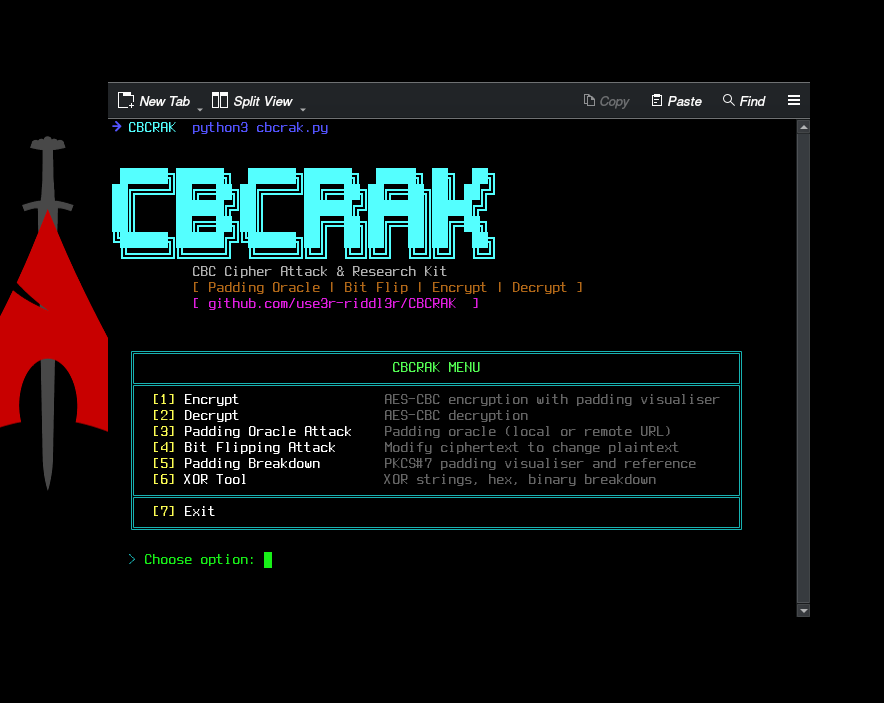

```
 ██████╗██████╗  ██████╗██████╗  █████╗ ██╗  ██╗
██╔════╝██╔══██╗██╔════╝██╔══██╗██╔══██╗██║ ██╔╝
██║     ██████╔╝██║     ██████╔╝███████║█████╔╝ 
██║     ██╔══██╗██║     ██╔══██╗██╔══██║██╔═██╗ 
╚██████╗██████╔╝╚██████╗██║  ██║██║  ██║██║  ██╗
 ╚═════╝╚═════╝  ╚═════╝╚═╝  ╚═╝╚═╝  ╚═╝╚═╝  ╚═╝
```

<div align="center">

**CBC Cipher Attack & Research Kit**


A practical toolkit for studying and demonstrating CBC-related cryptographic attacks.

</div>

---

## Overview

CBCRAK is a command-line tool for learning, demonstrating, and analysing CBC (Cipher Block Chaining) attack patterns. It focuses on common issues in CBC implementations, including padding oracle behaviour and bit-flipping weaknesses.


---

## Why CBC is Vulnerable

CBC mode is not inherently broken by itself. The problem is that many implementations expose enough information during decryption to make the mode unsafe when authentication is missing.

### Padding Oracle Attacks

In CBC decryption, the server or application must validate padding before proceeding. If that validation result is exposed through different responses, error messages, or timing behaviour, the system can become a padding oracle.

That leakage can allow an attacker to recover plaintext block by block without knowing the key.

### Bit Flipping

CBC also suffers from a predictable chaining property. A modified ciphertext block can alter the corresponding plaintext block in a controlled way. This can be used to tamper with decrypted data when the application does not authenticate the ciphertext.

---

## Why AES-GCM or AES-CCM Are Preferred

Authenticated encryption modes such as AES-GCM and AES-CCM are generally preferred over raw AES-CBC because they provide integrity and authenticity alongside encryption.

| Feature | AES-CBC | AES-GCM | AES-CCM |
|---------|---------|---------|---------|
| Encrypts data | ✅ | ✅ | ✅ |
| Authenticates data | ❌ | ✅ | ✅ |
| Padding oracle possible | ✅ | ❌ | ❌ |
| Bit flipping possible | ✅ | ❌ | ❌ |
| Used in TLS 1.3 | ❌ | ✅ | ✅ |

The practical rule is simple: use an authenticated encryption mode when possible.

---

## Features

- Padding Oracle Attack: local simulation or remote URL target, GET and POST support, optional multi-threaded brute force
- Bit Flipping Attack: step-by-step demonstration of ciphertext modification
- AES-CBC Encrypt: encryption with configurable IV and PKCS#7 padding visualisation
- AES-CBC Decrypt: decryption with padding breakdown and recovered plaintext output
- PKCS#7 Padding Tool: inspect padding behaviour for arbitrary input
- XOR Tool: XOR strings, hex values, and binary data

---

## Installation

```bash
git clone https://github.com/use3r-riddl3r/CBCRAK.git
cd CBCRAK
python3 -m venv venv
source venv/bin/activate
pip install -r requirements.txt
```

Requirements:

```text
pycryptodome
colorama
tqdm
requests
```

---

## Usage

```bash
python3 cbcrak.py
```

The main menu provides access to the available tools:



```text
╔═══════════════════════════════════════════════════════════════════════════╗
║                              CBCRAK MENU                                  ║
╠═══════════════════════════════════════════════════════════════════════════╣
║  [1] Encrypt                 AES-CBC encryption with padding visualiser   ║
║  [2] Decrypt                 AES-CBC decryption                           ║
║  [3] Padding Oracle Attack   Padding oracle (local or remote URL)         ║
║  [4] Bit Flipping Attack     Modify ciphertext to change plaintext        ║
║  [5] Padding Breakdown       PKCS#7 padding visualiser and reference      ║
║  [6] XOR Tool                XOR strings, hex, binary breakdown           ║
╠═══════════════════════════════════════════════════════════════════════════╣
║  [7] Exit                                                                 ║
╚═══════════════════════════════════════════════════════════════════════════╝
```

---

## Module Breakdown

### Encrypt
Encrypts plaintext using AES-CBC. Choose a key size, provide or generate an IV, and inspect the PKCS#7 padding before encryption.

### Decrypt
Decrypts AES-CBC ciphertext using the provided key, IV, and ciphertext input. The output includes the recovered plaintext and padding information.

### Padding Oracle Attack
Supports two modes:

- Local simulation: use a local oracle to study the attack flow without a remote target
- Remote URL: point the tool at a vulnerable endpoint using GET or POST requests

### Bit Flipping Attack
Demonstrates how a modified ciphertext block can alter the corresponding plaintext block in a predictable way.

### Padding Breakdown
Shows how PKCS#7 padding is applied to input data and provides a quick reference table.

### XOR Tool
Supports XORing plaintext strings, hex strings, single bytes, and repeating-key payloads.

---

## How the Padding Oracle Attack Works

The attack generally follows this sequence:

1. The target decrypts the supplied ciphertext and checks padding validity.
2. The response leaks whether the padding was valid.
3. The attacker submits modified ciphertext variants and observes the result.
4. By testing byte values, the attacker recovers the plaintext byte by byte.
5. The recovered plaintext is reconstructed block by block.

This is a classic demonstration of why padding validation should not leak information.

---

## Disclaimer 

CBCRAK is intended for educational use and authorised security testing only.


---

## License

MIT.

---


